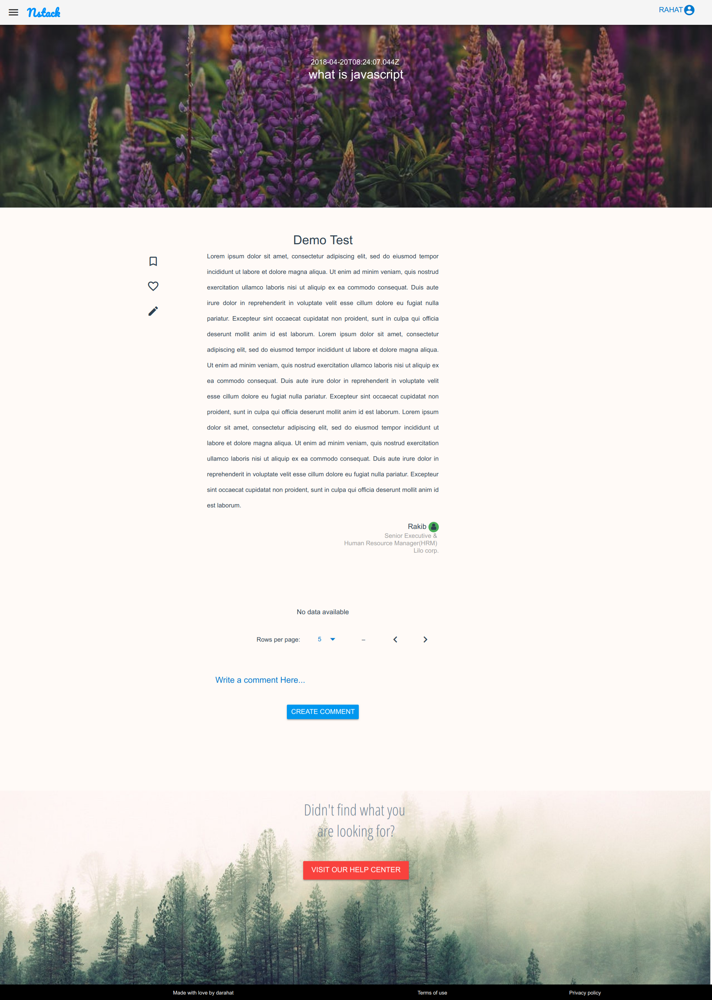
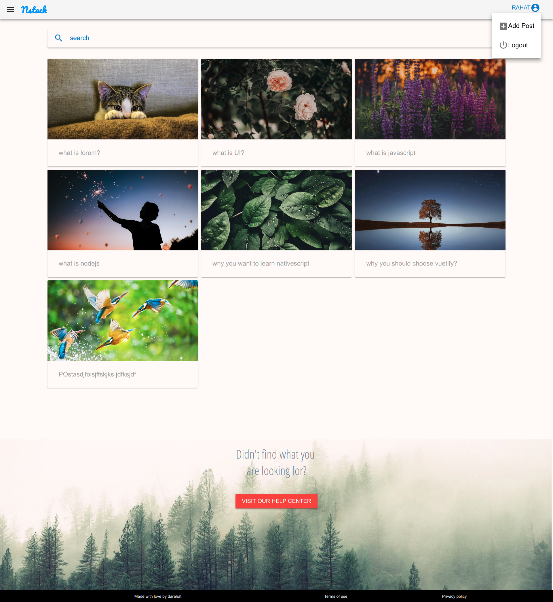
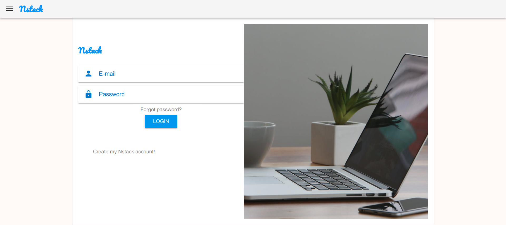
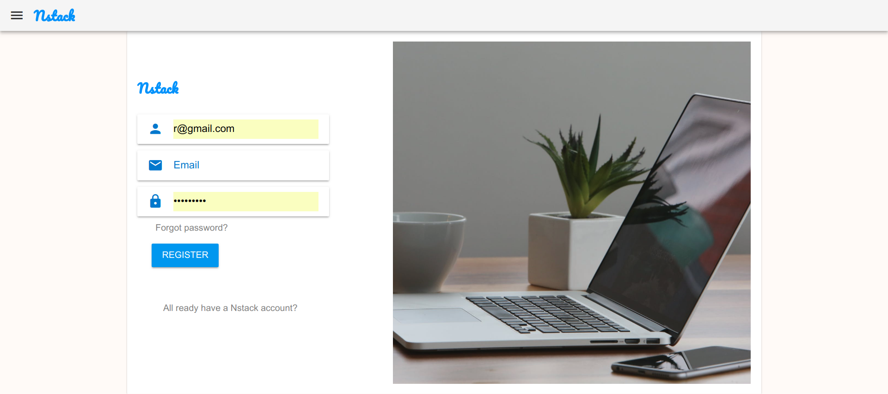

# Nstack
Nstack is a vuejs/node js CRUDE application for blogging.Its my first web application using Vuejs+Vuetify+NodeJS+Animate.css. 

* [Branches](#branches)
* [Screenshots](#screenshots)
* [Development](#development)
* [Contributor](#contributor)


<h2 id="branches">Branches</h2>

This repository contains a branche:

* The [**master** branch](https://github.com/Darahat/nstack.git) shows how to build a Cross Browser Responsible,Simple & Beautifully Designed CRUDE Web Application.The branch is built with vue.js.
This branch targets latest official release of Vue.js.


<h2 id="screenshots">Screenshots</h2>

### Post



### Index



### Login



### Register




<h2 id="development">Development</h2>
This app is built with the Vue CLI.Once you have the [CLI installed](https://vuejs.org/v2/guide/installation.html), start by cloning the repo:

```
$ git clone https://github.com/Darahat/nstack.git
```

Now you have to install ```npm``` on Client folder which will add dependencies according to ```package.json``` file.

### Client - Terminal A

```
cd client
npm install
npm run dev
```

Now you have to install ```npm``` on Server folder which will add dependencies according to ```package.json``` file.

### Server - Terminal B

```
cd server
npm install
npm start
```


* For detailed instructions About Vue.js, see https://vuejs.org/v2/guide/
* For detailed instructions About Vuetify, see https://vuetifyjs.com/en/getting-started/quick-start
* For detailed instructions About Node.js, see https://nodejs.org/en/docs/
* For detailed instructions About Animate.css, see https://daneden.github.io/animate.css/

<h2 id="contributor">Contributor</h2>

 Made With ❤️ By darahat

