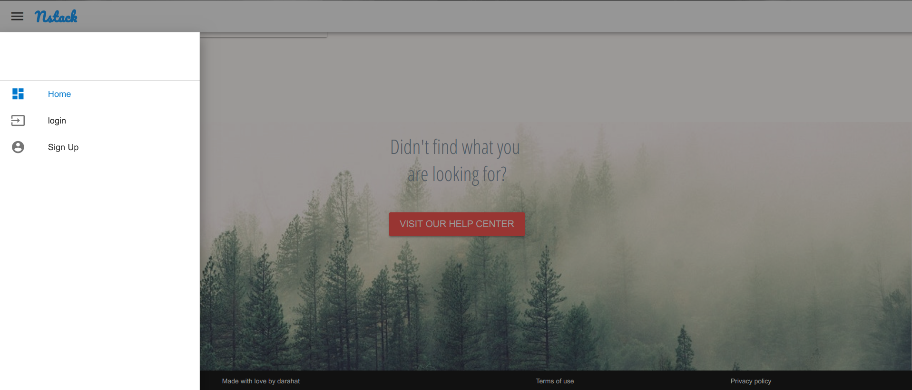

# Nstack
Nstack is a vuejs/node js CRUDE application for blogging.Its my first web application using Vuejs+Vuetify+NodeJS. 

* [Branches](#branches)
* [Screenshots](#screenshots)
* [Development](#development)
    * [Linting](#linting)
* [Contributors](#contributors)


<h2 id="branches">Branches</h2>

This repository contains a branche:

* The [**master** branch](https://github.com/Darahat/nstack.git) shows how to build a Cross Browser Responsible,Simple & Beautifully Designed CRUDE Web Application.The branch is built with vue.js.
This branch targets latest official release of Vue.js.


<h2 id="screenshots">Screenshots</h2>




<h2 id="development">Development</h2>
This app is built with the Vue CLI.Once you have the [CLI installed](https://vuejs.org/v2/guide/installation.html), start by cloning the repo:

To install Vue ClI

```
$ git clone https://github.com/Darahat/nstack.git
$ cd Rhymes
```


Now you have to install ```npm``` which will add dependencies according to ```package.json``` file.

``` bash
npm install
```
From there you can use the run command to run Rhymes on android:

```
npm run build:android
```

Build, watch for changes and debug the application
```
npm run debug:android
```

Build, watch for changes and run the application
```
npm run watch:<platform>
```

 Clean the NativeScript application instance (i.e. rm -rf dist)
```
npm run clean
```

For detailed instructions, see https://github.com/nativescript-vue/vue-cli-template

 Made With ❤️ By darahat

